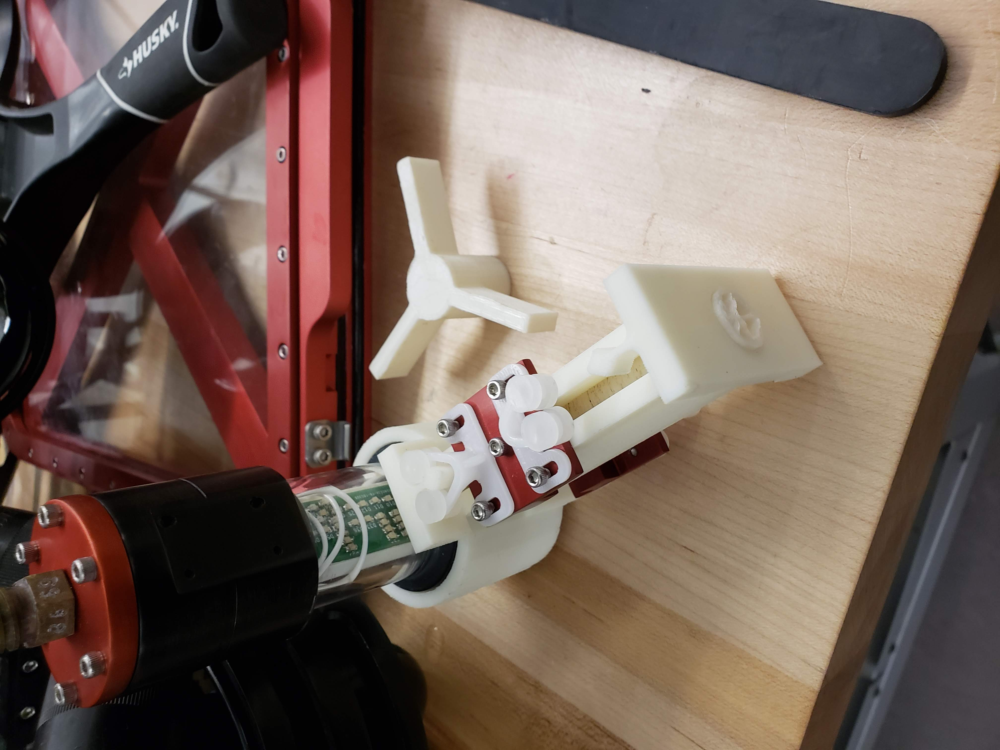
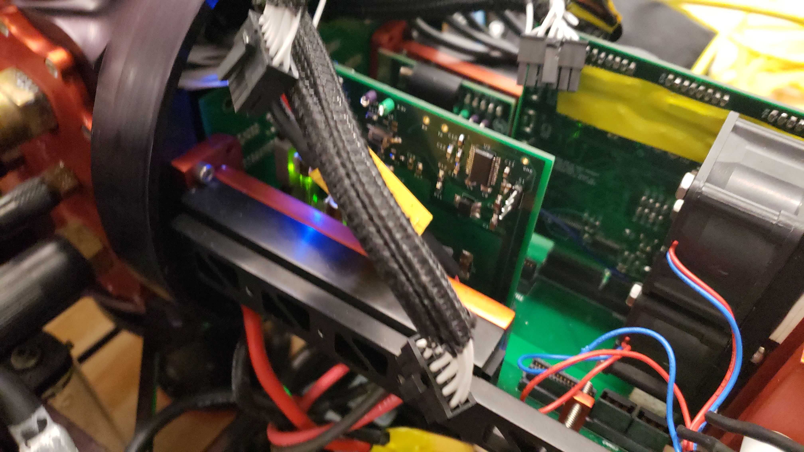

Over 5 years ago, from 2017 to 2021, I was part of the Cornell University Autonomous Underwater Vehicle (CUAUV) team developing electrical subsystems. Although I don't have a lot of reference material go back to and am mainly relying on my memory, I wanted to share the work I did and what I appreciated from my time there. 

# Overview

In highschool, what made me most interested in pursuing engineering wasn't the rigorous math and science it required but hands-on problem solving. In higschool, I enjoyed my time building robots with the team for FIRST robotics, getting a robot out for an annual competition. I knew I wanted to do similar project work for my undergrad. 

Cornell University hosts several project teams under the engineering departments enabling student orgs to build for a wide range of projects. I heard about CUAUV from project fest and their annual competition for AUVSI Robosub in San Diego. The team competes to autonomously (without human input) navigate an underwater course and score as many points as possible completing tasks including hitting targets w/ prop torpedos, hitting buoys, and carrying objects.  As an incoming Electrical Engineering student I saw the electrical subteam as a really great opportunity to learn designing and implementing reliable electrical subsystems end to end with greater depth. The last selling point was an inside joke of FIRST robotics, leading up to the game reveal every year someone would claim this would be the year that we had a water game. On this team, water game would be every year. 

During my time on the team, every year we rebuilt our two subs for this year's game. Each sub would draw power from two LiPo batteries, distribute that power to the remaining subsystems, provide a serial interface for the sub computer to provide I/O, take in sensor information including acoustics, drive thrusters, and control actuators. Allowing or disabling power to sub's mechatronics, thrusters and actuators, was done with a hall sensor kill switch. Each sub was also fitted with cameras. The pressurized hull kept water from getting into our vehicle damaging the inside electronics. Lastly the backplane board interconnected many of the power and data connections between the boards.

# My contributions

During my freshman year I worked on a test board to validate another subsystem's behavior (while driving mock inputs, the output voltages in range of expected, an output channel could handle drawing some current from a load resistor and get the expected current draw). Unfortunately due to design errors on my board I wasn't able to deliver on any significant validation testing. The summer after freshman year, I stayed on campus to maintain and fix boards, including Merge board, Kill switch board, and Serial board. 

Sophomore, Junior, and Senior year I worked on Merge board and prototyping redesigns to reduce brownouts while onboarding new team members. I made incremental improvements on the board but was unsuccesful moving the board toward an updated design for hotswapping power between our two LiPo batteries. 

# Designing subsystems

During the fall semester, each member was assigned a board to work on this year and a mentor or peer that could help guide working on the board. For signficant board revisions from last year's design, we kicked off a round of prototypes to quickly test the change with last year's sub. We designed our schematics and layout in KiCad with helper libraries to plot out the components. We performed both schematic and layout design reviews to get input on our subsystem. Once a board was ready for manufacturing, we sent the Gerber files to our manufacturer and order a bill of materials w/ DigiKey and Mouser.

Checks performed either through design review or with KiCad:
- No unconnected nets.
- Check net labels matched where expected and typos didn't accidentally prevent connections.
- Power paths had enough trace thickness to mitigate failure and resistance.
- Following the datasheet requirements (Microcontroller, integrated circuit, etc.).
- Component is available for purchase online and doesn't require bulk orders.
- Minimal and differential tracing for high speed signal pairs including for Serial and the external crystal oscillators.
- Correct voltages and polarity driven to each pin.
- Correct footprint for each component.
- Components are not placed not too close to each other to mitigate population difficulty.
- Test points to support debugging of issues.

# Populating PCBs

A week before the Spring semester would start, the electrical engineering team would come back to campus to start populating components onto our boards. We would hand solder the microcontroller, ICs, etc. on the board and incrementally validate behavior. 

Most of the boards had their first test to populate the microcontroller, LDO, resistor, LED, and power test points then confirm we could get the blink code template to pass. If that worked we could verify the microcontroller was populated well, at least for a few of the pins. Boards would be powered from a digital power supply with a current limit set to mitigate damage from shorts.

When a board didn't operate as expected and we needed to debug we had a few options. For relatively static signals we could use a multimeter to measure a voltage signal of interest, measure current in path, and when the board is off check for continuity or resistance between points. We also had an oscilloscope where we could capture signals of interest up to 100 MHz. Lastly if the microcontroller was operational and it could probe the signal of interest we could read and write to debug variables and over serial expose those values. 

If a correction needed to be made on the board we would either solder jumpers, cut trace wires, and if needed, redesign the board.

# Writing firmware for the subsystems

I believe our software stack was CMake, C, protobuf-c, and AVRDude for Atmel Microcontrollers. Many of the boards had digital I/O, reading of analog measurements such as current shunt monitors either through the Microcontroller's internal ADC or an external ADC connected over SPI or I2C, and then communicating inputs and outputs over serial w/ protobuf-c. The team defined helper libraries for serial communication but a lot of our work still required carefully referencing the Atmel microcontroller's documentation on how to go about an operation, setting the appropriate bitmasks, or how to utilize interrupts. 

# Integration and repairing

Around mid Spring semester all manufacturing of parts from the mechanical and electrical subteams would be done and the team would try to integrate everything together and perform comprehensive tests and checks. If all went well the team would be able to take the sub to occupy the entire swimming pool and give the software team opportunities to test with the subs tethered over ethernet. When the sub batteries were running low we would pull the sub out of the water, swap one battery at a time and continue testing. On occasion, the sub would require some repair including replacing fuses. The sub hull would be repressurized prior to going back into the water.

# Learnings

## Scope Creep Sucks

I remember the biggest setback I experienced on the team was navigating an ambiguous scope of validating board behavior for each subsystem of the team. The ideal case was any board could plug in their board, my board would run tests validating I/O behavior, and over serial and with the test board status LED we would report back success or failure. Because of lack of prioritization and scope I tried to implement as much as possible (measuring voltage and current from as many channels, handling all the different port mappings of the different boards, supporting direct serial interaction between test board and the board under test) that I ended up making several mistakes in the design and the board was difficult to get peer feedback from the team. The lack of success of my freshman year project on the team was a lesson on how to narrow scope on a large ambiguous problem and to reach out to my upperclassmen on what the biggest priorities were.  

## Incremental Checks

The summer after freshman year when I stayed to help with integration and testing, me and the other electrical members had to make sense of boards we did not work on, triaging and fixing failures. When Merge board failed, I first checked the board's LEDs, was the microcontroller still blinking it's heartbeat LED? Did the board have the disabled power LEDs on for Mechatronics and non mechatronic power. Then probe with a multimeter, each part of the power path to see where there wasn't a voltage difference between that point and ground. If a microcontroller digital signal was expected to enable/disable power in this power path, I would also check the expected control signal was set while checking the schematic and layout. Thanks to checks like this I could narrow down which parts may be failing and what may need to be replaced (power mosfets, hotswap controllers, fuses, etc.). 

# Fun Stories

## Interviewing for the team

Being on the other side, screening applicants was also an interesting experience. For those interested in applying, show genuine interest, and no matter what do not say "you have an affinity for water". That phrase kept showing up for applications before the LLM days and I don't know if this was another project team's prank or applicants trying to tie themselves as much as possible to the project team. 

I also really appreciated the interviewing process for the team assessing your ability to problem solve. Two common interview problems we did was how to drive a motor w/ an H bridge and how you can control a motor's speed w/ a digital signal (PWM). Even if you didn't know these concepts, enough context was provided and hinted to the candidate that they would still have a shot of reaching a good solution. For example, electricity flows from high potential (voltage) to low potential and in this schematic here these symbols (transistors) act as switches. We need to control these switches such that the motor is moving forward. I also have to thank my time on FIRST robotics and my technical mentors that I was familiar with motors, motor controllers, and H bridges. 

## Laptop Falling apart and learning Linux

During Freshman year, when my SSD on my personal laptop was failing to boot several times (I forgot what cascade of failures occurred), a member of the team suggested I try out Linux as my laptop's operating system. It's thanks to their introduction and a little bit of help that I got used to use a different OS than Windows 11. Now a large majority of my time on my computers (excluding gaming) is on a Linux OS.

## Training to be a lifeguard

In order for the team to use the Teagle pool for testing our vehicles, we would have to supply our own lifeguard to supervise the team's safety. During junior year, we were down to 1 lifeguard certified student on the team. Another couple team members and I trained for the lifeguard certification in Ithaca YMCA. I wasn't as strong of a swimmer but thanks to a friend of the team I improved a ton and passed the lifeguard test. It was tough, especially unlearning some habits and taking a project heavy courseload but I was proud of getting it done and supporting the team.

## Sanding parties

To assist the mechanical team with part manufacturing, a team requirement in the spring is to help sand down parts of our vehicles. We watched movies and chatted a lot for hours. After all the sanding was done, the parts were oxidized to the red and black asthetic matching the school's colors.

# Conclusion

I really appreciated my time on this team. Many thanks to the peers and friends I met here. Although in my professional career, I leaned more toward Software Engineering, my experience on this team gave me the skills, knowledge, and confidence to contribute toward hardware systems. My experience with Protobufs from this team also gave me a headwind implementing gRPC backends at Google. During my time at Two Six, I was able to reference schematics, implement firmware, and escalate hardware issues I noticed from our prototypes. Sure it may have been a long while ago, but I'm hopeful if I ever need to design another PCB, I can get it done.

# Links to learn more

- [CUAUV Site](https://cuauv.org/)
- [2023 blog post by Parker Schless improving Merge board](https://medium.com/@cuauv.cornell/blowing-the-sub-up-is-not-ideal-i-am-looking-at-you-merge-board-55119c93d46)
-
